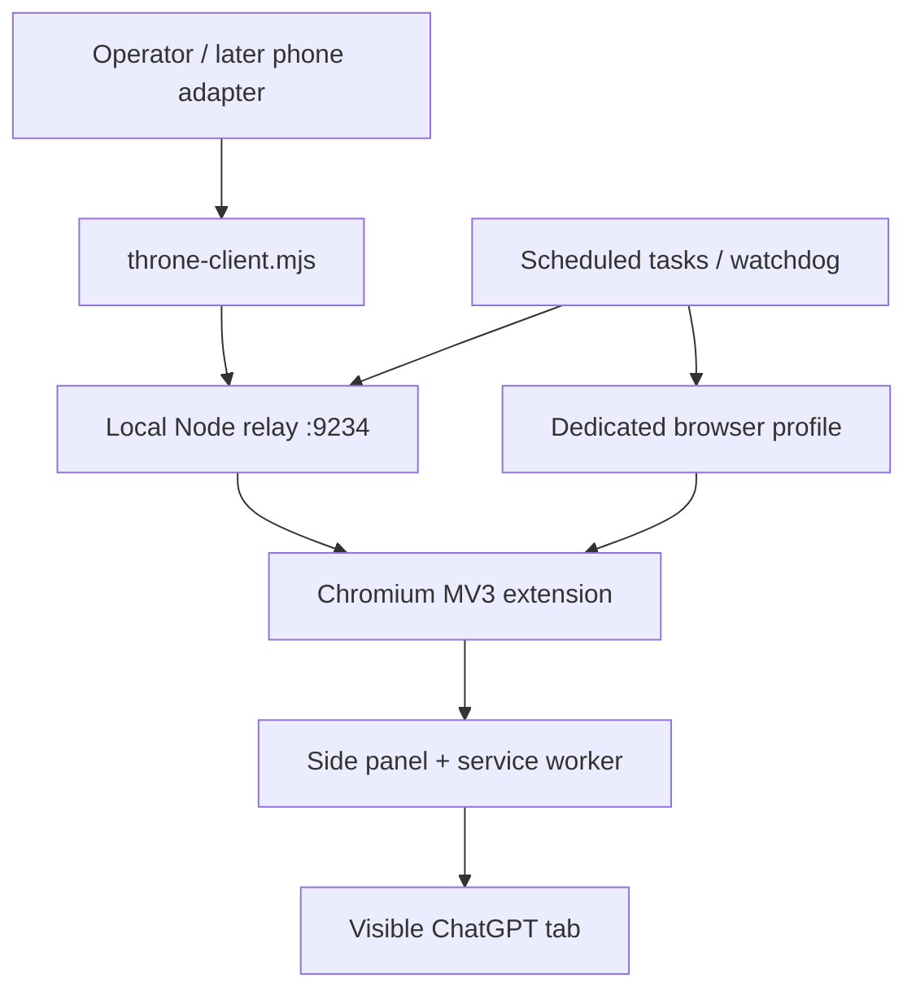

# Chromium Throne — Excavation Record

> **HISTORICAL / QUARANTINED / DO NOT REUSE**
>
> This public repository documents what Chromium Throne was. It is not the Chromium Throne source repository, not an installer, not a revival project, and not a recommendation to reuse its architecture.

## Plain answer

Chromium Throne was a **composite browser-orchestration lane** embedded inside the much larger [`Valar05/home-center`](https://github.com/Valar05/home-center) repository under the older name **Browser Porch**.

It was not one thing:

1. a Manifest V3 Chromium extension named **Chromium Throne**;
2. a side-panel interface and service worker;
3. scripts injected into visible, authenticated `chatgpt.com` tabs;
4. a local Node relay on `127.0.0.1:9234`;
5. a CLI client that submitted commands to that relay;
6. a dedicated Chromium profile and launcher;
7. scheduled-task/watchdog machinery intended to keep the relay and browser alive;
8. later phone/Termux/SSH adapters that treated the desktop lane as remote “muscle.”

Calling it “a browser plugin” is incomplete. Calling it “orchestration” is also incomplete. It was a browser extension wrapped in a local control plane, persistence machinery, and campaign doctrine.

## Identity card

| Field | Finding |
|---|---|
| Canonical name | Chromium Throne |
| Earlier/source name | Browser Porch |
| Original home | `Valar05/home-center/browser-porch/` |
| Standalone repository | None found before this excavation repository |
| Browser surface | Chromium/Chrome/Edge extension side panel |
| Worker surface | Visible authenticated ChatGPT tabs |
| Local transport | Node loopback relay at `http://127.0.0.1:9234/v1/throne` |
| Browser identity | Dedicated Chromium profile |
| Compute doctrine | ChatGPT Pro reasoning in visible tabs; no API-token substitute |
| Runtime persistence | Scheduled tasks/watchdogs and restart logic |
| Proven state | Repository source existed |
| Unproven state | Deployment, callability, end-to-end execution, and human acceptance |
| Current ruling | Historical documentation only; do not reuse |

## Architecture recovered

The architecture changed while it was being built. Some evidence describes service-worker-owned parallel visible workers; the later `0.7.0` contract narrows the system to one persistent Pro conversation with explicit recovery-only rotation. That is evolution evidence, not proof of a stable accepted product.

## Why this is quarantined

- Chromium Throne never earned runtime acceptance.
- Source-level contracts and fixtures were repeatedly confused with deployment evidence.
- CI/workflow records around August 13–14, 2026 repeatedly failed.
- The lane accumulated extension code, relay code, browser-profile state, authentication assumptions, scheduled tasks, watchdogs, phone adapters, SSH routing, and project doctrine in one organism.
- The current commission explicitly preserves it for excavation, **not reuse**.

This repository deliberately contains no source transplant, extension package, installer, capability token, cookie, browser profile, scheduled-task command, or runnable resurrection path.

## Excavation map

- [Evidence ledger](./EVIDENCE.md) — supported facts, uncertainty, source routes, and archaeology questions.
- [Project state](./state.md) — commission locks, capability state, and the exact stop condition.

## Primary public source routes

- [Browser Porch / Chromium Throne README](https://github.com/Valar05/home-center/blob/main/browser-porch/README.md)
- [Extension manifest](https://github.com/Valar05/home-center/blob/main/browser-porch/extension/manifest.json)
- [Phone swarm integration attempt, PR #268](https://github.com/Valar05/home-center/pull/268)
- [Original containing repository](https://github.com/Valar05/home-center)

## Reuse boundary

Public visibility does not grant a license. No license is offered by this repository. The documentation may be read and cited as historical evidence; the Chromium Throne architecture and code are not being offered for reuse here.
