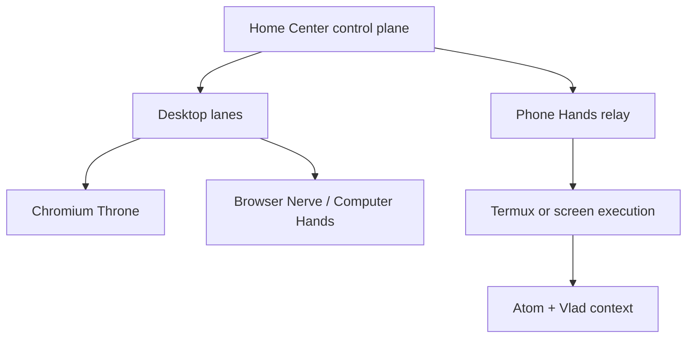
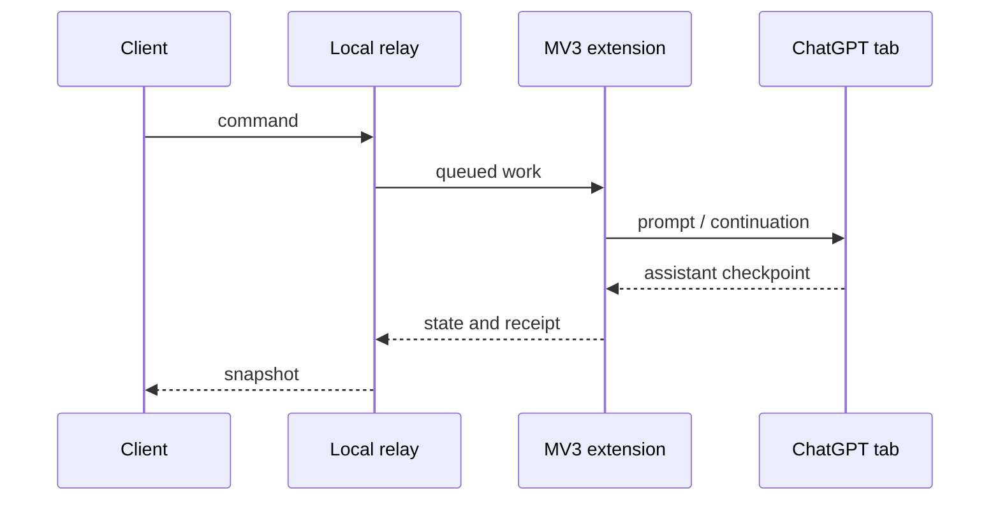
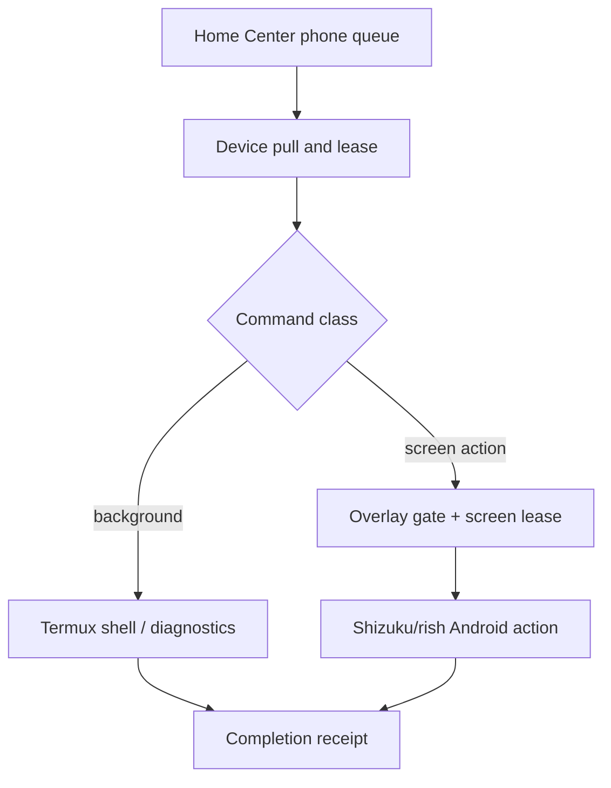
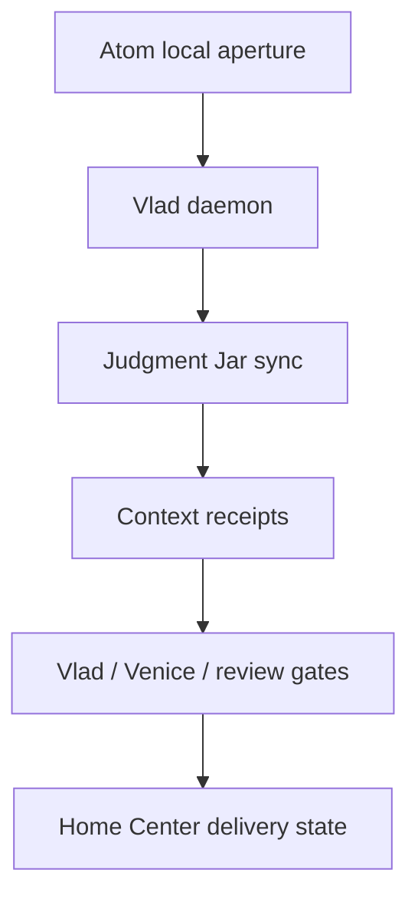

# System Architecture

## 1. Boundary statement

The safest recovered description is: **Fortress Online attempted to make a sovereign phone and a sovereign computer bidirectionally controllable through receipted Home Center lanes.** Browser automation and phone automation were related subsystems, not a single binary or conventional browser plugin.

The phrase “Chromium Throne” was used narrowly for a desktop ChatGPT browser stack and broadly for the desired browser-control throne in the Fortress organism. This graveyard uses the narrow technical meaning and names adjacent systems explicitly.

## 2. Component dictionary

| Name | Recovered role | Not the same as |
|---|---|---|
| Chromium Throne | Desktop Chromium/ChatGPT extension, local relay, client, dedicated profile, and queue/state model | Browser Nerve; Phone Hands; Android Chromium control; Vlad |
| Browser Porch | Source area containing the Chromium Throne extension and related browser-facing material | The whole Fortress runtime |
| Browser Nerve | Ticketed Chrome DevTools Protocol browser executor | Chromium Throne extension UI/queue |
| Computer Hands | General Windows workstation execution body, associated with `windows-hands-01` / THECAULDRON | Browser-only control |
| Phone Hands | Home Center-to-Android/Termux command and receipt system | The Android overlay alone |
| Android operator overlay | On-device visible control gate, mute/hide/collapse state, heartbeat, and screen-lease coordination | Background Termux execution |
| Android Chromium control | Phone Chrome-family navigation and observation through the Android execution lane | Desktop Chromium Throne |
| Atom | Phone-local command/status/context aperture | Vlad daemon |
| Vlad | Long-running phone-side Judgment Jar synchronization and fast-context service | Tap/swipe executor; Chromium extension |
| Venice | Continuation/review/planning participant referenced in browser and phone campaign paths | Transport proof or device execution proof |
| Harroway / Judgment Jars | Routing and judgment context used by workers and review gates | A browser driver |

## 3. Whole-system topology

This drawing describes intended relationships, not current liveness.

## 4. Desktop browser path

The relay accepting a command was not acceptance of the work. The service worker explicitly separated enqueue/accepted state from completion. Browser authentication in the dedicated profile was a distinct prerequisite and was reported as a remaining gate.

## 5. Phone path

Background `phone_shell` was designed to avoid dependence on the overlay, screen leases, Wireless Debugging, or Shizuku. UI actions were designed to fail closed unless the overlay control gate and screen activity lease permitted them.

## 6. Vlad and context path

Vlad synchronized and exposed judgment context; Vlad was not the transport carrying every command and was not the body executing every device action. A Vlad heartbeat or Jar sync proved only that particular context lane unless an end-to-end receipt connected it to the requested action.

## 7. Recovered state machines

### Chromium Throne work

Observed concepts included queued, running, captured/checkpointed, stopped, resumed, completed, and failed work. A single persistent authenticated Pro worker and bounded context were favored in the recovered v0.7.0 source. Older ambitions for larger parallel swarms must not be confused with that later single-worker implementation.

### Phone relay work

The phone relay pulled commands for a named phone queue, leased work, dispatched by capability, and completed or failed with receipts. Screen-changing work required gate/lease checks; non-screen background work used a different authority path.

### Campaign/review work

Campaign scripts tracked phases and probes, attempted bounded repair, generated review packets, and required named review gates. “Operational” inside a campaign was not self-release authority. Review and human acceptance remained separate.

## 8. Trust and authority boundaries

| Boundary | Recovered control |
|---|---|
| Cloud to phone | Pull/lease/complete queue plus device authentication material stored locally |
| Local HTTP bridge | Loopback or private-network binding, bearer authorization, capability declaration |
| Android UI | Overlay control gate and screen lease; fail-closed state reads |
| Android privileged actions | Shizuku/rish-backed execution |
| Background phone work | Termux subprocess path independent of UI gate |
| Desktop browser | Dedicated profile, extension origin, localhost relay, capability file |
| ChatGPT session | One-time human sign-in to dedicated profile |
| Review/context | Atom, Vlad/Jar sync, Venice/reviewer outputs, typed receipts |

## 9. Evidence conflicts and uncertainty

- The user-level contract described browser thrones on both phone and computer. The surviving implementation evidence shows a named desktop Chromium Throne plus a separate Android Chromium controller. The intention and the concrete implementation are both preserved.
- Browser Porch documentation described source implementation while warning that deployment and acceptance were not established.
- Installer receipts used language such as “ready for runtime canary”; that is pre-acceptance evidence.
- Historical recovery material said Browser Nerve’s CDP lane had been repaired, while dedicated-profile authentication remained a gate. No fresh current-runtime canary was performed for this graveyard.
- CI records around the recovered period included failures for Chromium Throne, Home Center CI, Android builds, and Phone Hands relay wiring. Failures are evidence of unresolved integration, not proof that every component was broken.
- The currently visible source snapshot and the deployed Home Center bridge revision were not the same commit. This is a deployment-drift warning.

## 10. Archaeological conclusion

The organism was architecturally coherent in concept: a cloud control plane, desktop browser and workstation bodies, a phone relay with separate background and UI authorities, and a context/review nervous system involving Atom, Vlad, Venice, Harroway, and Judgment Jars. The graveyard does not claim stable whole-organism operation. It preserves enough topology and provenance to understand the system without reviving it.
